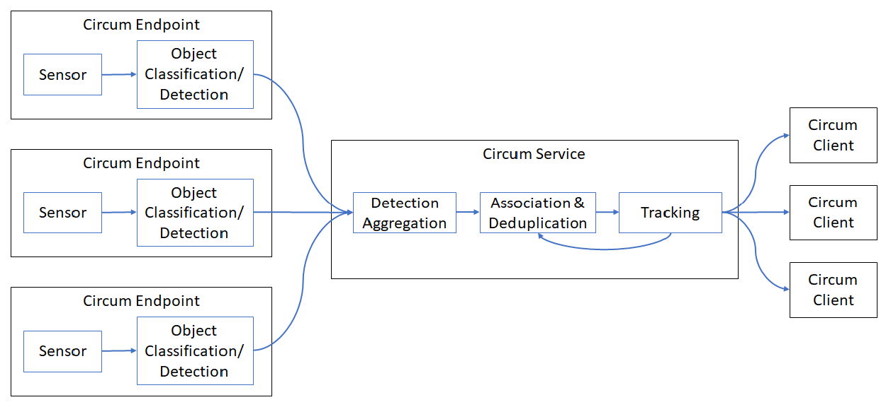

# circum

 

Circum is a distributed, multi sensor fusion system for detecting and tracking people. It applies techniques similar to systems developed for autonomous vehicles to detect and track moving objects (DATMO). Circum uses late fusion, meaning that detections are classified per sensor and then fused (associated and deduplicated) and tracked after. Because different sensors provide different capabilities (e.g. point vs volume detection), these properties will be combined in the final tracking output.

Circum is intended for art installations wanting to use human presence as an input into an interactive installation.



## Install

```bash
pip3 install circum
```

## Usage

### Service

```bash
Usage: circum [OPTIONS]

Options:
  -n, --name TEXT       The service name  [required]
  -i, --interface TEXT  The interface to bind to.
  -p, --port INTEGER    The port to bind to.
  -e, --endpoint TEXT   Names of endpoints to connect to. Can be specified
                        multiple times. If no endpoints are specified, all
                        available endpoints will be used.
  --help                Show this message and exit.
```

### endpoint

```bash
Usage: circum-endpoint [OPTIONS] COMMAND [ARGS]...

Options:
  --name TEXT         The service name
  --interface TEXT    The interface to bind to.
  --port INTEGER      The port to bind to.
  --pose FLOAT...     The pose of the sensor. Expressed in x y z yaw(Rx)
                      pitch(Ry) roll(Rz) order.
                      Units are meters and degrees.
                      +Z is the direction of sensor view. X & Y follow the
                      right hand rule.
                      If a pose provider is installed, this
                      will override it.
  --pose-provider [<available providers installed from plugins will be listed here>]
                                  The pose provider to use for automatically
                                  determining the sensor pose.
                                  NOTE: this is
                                  currently unsupported
  --help                          Show this message and exit.


Commands:
  simulator
  <additional sensors installed from plugins will be listed here>
```

To get the help for a particular sensor add --help after the appropriate command:
```bash
?> circum-endpiont simulator --help
Usage: circum-endpoint simulator [OPTIONS]

Options:
  --update_interval FLOAT  Rate to send updates.
  --num_objects INTEGER    Number of objects to simulate
  --help                   Show this message and exit.
```

## Service

The circum service can be started with unique name and either a list of endpoints to connect to or it will find and
connect to all circum endpoints on a network. Once connected to the endpoints, it will use pose and field of view
information from each endpoint to combine tracking data into a single view which it will then transmit to clients
whenever updated.

### Coordinates

Circum, by convention, uses a right handed coordinate system with y as the vertical axis and +y zenith pointing. Circum,
itself, doesn't enforce or care about this, but, if a given application is deviating from this convention, it is
important to ensure that the endpoints are all using the same coordinate convention or the resulting tracks will be
unusable.

### Discovery

The circum service will advertise itself via zeroconf service discovery. It will advertise under

```console
<name>._service._circum._tcp.local.
```

## Endpoints

Endpoints perform detection and classification and transmit information about the detected objects to the core service.
At the very least, the endpoint must transmit a centroid of a detected person. The core service operates on this. Any
additional information is added into the fused track for clients to consume. Each endpoint is configured with a unique
name.

### Coordinates

Circum supports automatically updating tracked objects based on the pose of the sensor. This assumes a right handed
sensor coordinate system with +z extending out from the sensor, +y vertical, and +x horizontal when θ<sub>x</sub>,
θ<sub>y</sub>, and θ<sub>z</sub> are all 0. If the sensor has a different coordinate system, it mist be transformed to
this system first.

### Discovery

Each endpoint is exposed as a discoverable zeroconf service. They are advertised under

```console
<name>._endpoint._circum._tcp.local.
```

### Sensors

Circum is distributed with a simulator endpoint. Additional endpoint sensor types are installed via plugins.

Supported sensors:

* [Walabot](https://github.com/LumineerLabs/circum-walabot)  
* [HC-S04 Ultrasound](https://github.com/LumineerLabs/circum-hc-sr04)  

Sensors in Development:

* [Camera + ML](https://github.com/LumineerLabs/circum-cam)  
* [Kinect](https://github.com/LumineerLabs/circum-kinect)  

Planned sensors:

* [IR Camera](https://github.com/LumineerLabs/circum-ir)  

### Discovery

The endpoints will advertise under

```console
<name>._endpoint._sub._circum._tcp.local.
```

The type of endpoint will be noted in the service properties

|    Type     | Type Tag  |
|-------------|-----------|
| Walabot     |  walabot  |
| FLIR Camera |  flir     |
| Kinect      |  kinect   |
| Camera      |  cam      |
| Simulator   | simulator |

## Demo

After installing circum and downloading the git repo, run the following in separate terminals (you can substitute your own values for FOO, BAR, 8081, and 8082):

```bash
circum-endpoint --name FOO --port 8081 simulator
circum-service --name BAR --port 8082
python3 .\examples\demo_client.py --service BAR
```

## References

Circum would not have been possible without the following references:

* R. Omar Chavez-Garcia. [Multiple Sensor Fusion for Detection, Classification and Tracking of MovingObjects in Driving Environments.](https://icave2.cse.buffalo.edu/resources/sensor-modeling/sensor%20fusion.pdf) Robotics \[cs.RO\]. Université de Grenoble, 2014. English. <tel-01082021>
* [Sensor Fusion and Object Tracking using an Extended Kalman Filter Algorithm — Part 1](https://medium.com/@mithi/object-tracking-and-fusing-sensor-measurements-using-the-extended-kalman-filter-algorithm-part-1-f2158ef1e4f0) & [Part 2](https://medium.com/@mithi/sensor-fusion-and-object-tracking-using-an-extended-kalman-filter-algorithm-part-2-cd20801fbeff)